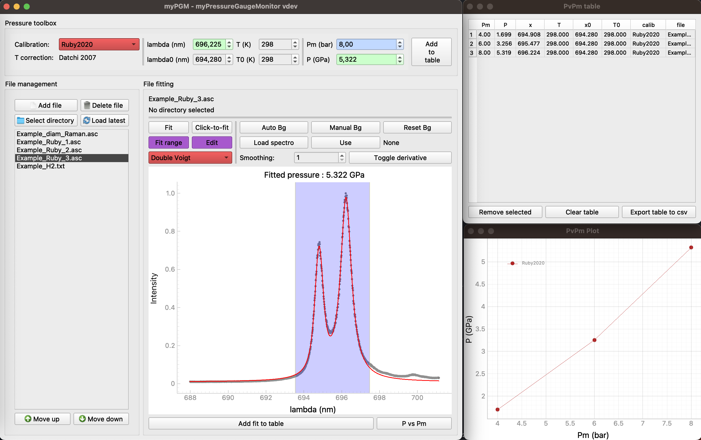

<h1 align="center"> myPGM - Pressure Gauge Monitor </h1>

<div align="center">
 </img>
</div>

<br>

**myPGM** is a desktop application for fitting spectroscopic pressure gauges and estimating pressure in high-pressure experiments.

It currently supports the following pressure scales:
- Ruby fluorescence
- Samarium doped strontium borate fluorescence
- Molecular hydrogen vibron
- Cubic boron nitride Raman
- Diamond Raman edge.

**myPGM** also provides a simple workflow to process multiple spectra and track pressure evolution during a typical diamond anvil cell experiment. The external pressure control is currently intended for membrane pressure in membrane DAC setups.

# Main features

- Load and organize several spectra in the same session, including quick access to the latest file from a selected acquisition folder.
- Fit pressure markers with several line-shape models, including single or double peak profiles and Raman edge fitting depending on the selected calibration.
- Switch between supported calibrations directly from the interface and adjust pressure, reference position and temperature parameters interactively.
- Apply basic spectrum preprocessing before fitting, including smoothing, automatic background subtraction and manual background definition.
- Use an optional spectrometer calibration file to recalculate the spectral axis when needed.
- Store fitted points in a dedicated pressure table, visualize pressure evolution in a P vs Pm plot, and export the table to CSV.
- Save and reload complete working sessions, including loaded spectra, fit results, table entries and spectrometer calibration state.

**myPGM** is still a work in progress, so please open an issue or contact the authors if you notice a bug or unexpected behavior.

# Quick start

Once the application is running, a typical workflow is:

1. Load one or several spectra.
2. Select the appropriate calibration and fit model.
3. Apply smoothing or background subtraction if needed.
4. Run the fit and inspect the extracted pressure.
5. Add selected results to the table to follow pressure evolution during the experiment.

# Installation from source

### 1) Get a copy of the code:

```bash
git clone https://github.com/AHilberer/myPGM.git
````
```bash
cd myPGM
```

### 2) (Optional) Set up a virtual environment in the code folder:

```bash
python3 -m venv .venv
```
```bash
source .venv/bin/activate
```

Later, to exit the virtual environment use:

```bash
deactivate
```


### 3) Install the required dependencies:

```bash
python3 -m pip install -r requirements.txt
```

### 4) Run the application:

```bash
python3 run.py
```

# Executables
Currently not available (WIP)

# Contributors

- __Antoine Hilberer__ - antoine.hilberer@cea.fr
- __Alexis Forestier__ - alexis.forestier@cea.fr
