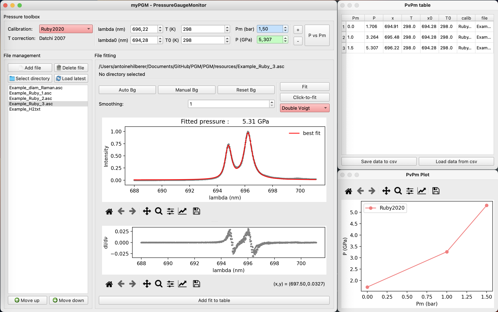

<h1 align="center"> myPGM - Pressure Gauge Monitor </h1>

 </img>

**myPGM** is a spectroscopic pressure gauge fitting software for pressure determination in high pressure experiments.

It currently supports the following pressure scales:
- Ruby fluorescence
- Samarium doped strontium borate fluorescence
- Molecular hydrogen vibron
- Cubic boron nitride Raman
- Diamond Raman edge.

**myPGM** supports a simple file management system to process multiple spectra and follow pressure evolution during a typical diamond anvil cell experiment (the external pressure control is set to be membrane pressure for membrane DAC experiments, for now).

## Installation from source

### 1) Get a copy of the code:

`$ git clone https://github.com/AHilberer/myPGM.git`

`$ cd myPGM`

### 2) (Optional) Set up a virtual environment in the code folder:

`$ python3 -m venv .venv`

`$ source .venv/bin/activate`

### 3) Install the required dependencies:

`$ python3 -m pip install -r requirements.txt `

or manually install the required non-native python packages: numpy, pandas, matplotlib, scipy and PyQt5.

### 4) Run as a script:

`$ python3 PGM/PGM.py`

If you are using a virtual environment use

`$ deactivate`

to quit it.

## Executables
Currently not available (WIP)

## Contributors

- Antoine Hilberer
- Alexis Forestier
